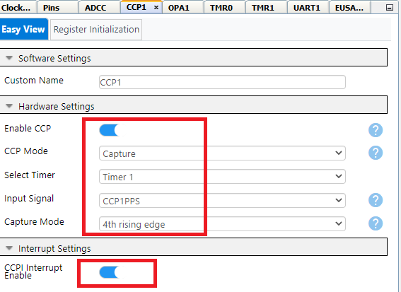
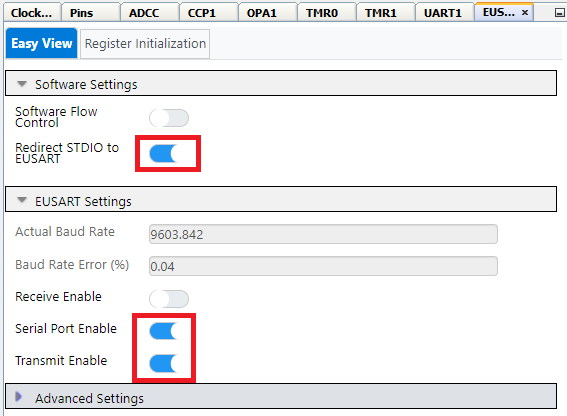

# Water TDS Measurement using PIC16F17146 Microcontroller

# Introduction

In this code example, a TDS probe with an integrated temperature sensor is used for the measurement of water conductivity and temperature. TDS relates to the presence of dissolved impurity (Ca+ and Mg+ ions) in water. More impurity leads to more conductivity. Therefore, the TDS value is directly proportional to water conductivity. In another way, TDS measurement is performed by measuring the conductivity of water.

To measure the water conductivity, the integrated op-amp module (OPA) is used in relaxation oscillator configuration which generates frequency as per input resistance (Water TDS). Capture/Compare/PWM module (CCP) captures this frequency without CPU intervention. The conversion of frequency to TDS value is then performed in the firmware. The temperature of the water affects its conductivity. Thus, the TDS value is also a function of water temperature. ADCC samples the temperature sensor output and the TDS value is compensated as per the temperature. Finally, the TDS value is displayed on the terminal window.

## Related Documentation
-	[PIC16F17146 Product Page](https://www.microchip.com/product/PIC16F17146)
-	[PIC16F17146 Data Sheet](https://www.microchip.com/DS40002339)

## Software Used
- MPLAB® X IDE [6.00 or newer](https://www.microchip.com/mplab/mplab-x-ide)
- Microchip XC8 Compiler [2.35 or newer](https://www.microchip.com/mplab/compilers)
- MPLAB® Code Configurator (MCC) [5.1.1 or newer](https://www.microchip.com/mplab/mplab-code-configurator)
-	Microchip PIC16F1xxxx Series Device Support (DFP) [1.13.178 or newer](https://packs.download.microchip.com/)

## Hardware Used
-	[PIC16F17146 Curiosity Nano Board](https://www.microchip.com/en-us/development-tool/EV72J15A)
-	[Curiosity Nano Base Board](https://www.microchip.com/development-tool/AC164162)
-	[Proto Click](https://www.mikroe.com/proto-click)
- [TDS Probe](https://www.hmdigitalindia.com/collections/accessories/products/sp-2)
-	Resistors (Three 100k)
-	Capacitor (0.1 uF)

## Hardware Setup

## Hardware Connection
PIC16F17146 curiosity nano board is used as a development platform. The curiosity nano baseboard is used for connecting click boards to the curiosity nano board. Proto click is used as a general-purpose PCB to connect the TDS probe, 100K resistors, and 0.1 uF capacitor to the OPA terminals. Proto click is placed in slot 3 of curiosity nano baseboard. OPA is configured as a relaxation oscillator. Refer to the below figure for connection details. OPA output is connected to the CCP module's input using a jumper wire. (yellow jumper cable in the above image) A temperature sensor is connected to ADCC's positive channel.

*Note: Three RC2 pin showed in the image is just for reference.   There is only single RC2 pin in the device.*  

## Pin Connection Table

| Pin | Signal Description                    
| --- | -------------------                
| RC4 |  CCP1 Input           
| RB5 |  EUSART RX
| RB7 |  EUSART TX         
| RC2 |  OPA Output            
| RC3 |  OPA Non-Inverting Terminal*                 
| RA2 |  OPA Inverting Terminal*         
| RC5 |  TDS Temperature Sensor Output*

**Note: Connection from PIC16F17146 curiosity nano to click slot is not available for these pins. Jumper cables are used to make the required connections. For OPA Non-Inverting Terminal pin, short INT3 and AN2 of Curiosity Nano Base Board. For OPA Inverting Terminal pin, short CS3 and AN1. For Temperature Sensor output pin, short RST3 and MOSI.*

## Demo Operation
Frequency generated by OPA module and temperature is measured continuously and converted to the equivalent TDS value. The TDS along with the temperature value is then displayed on the terminal window every 1 sec.

The microcontroller sends data to the PC with a baud rate of 9600 using UART with the help of the virtual serial port feature of the onboard debugger. To see the messages in a terminal window, connect the curiosity nano board to any terminal emulator. Data Visualizer which is available as a plugin to MPLAB X IDE can be used as a terminal emulator.

"Probe disconnect" message is displayed on the terminal if the TDS probe gets removed. If the TDS value is more than 10000, the terminal window displays a "TDS range error" message.

## Peripheral Configuration using MCC
This section explains how to configure the peripherals using MPLAB X IDE with the MCC plugin for the recreation of the project.

Refer [Software Used](https://github.com/microchip-pic-avr-examples/pic16f17146-water-tds-measurement-mplab-mcc#software-used) section to install required tools to recreate the project.

Additional Links: [MCC Melody Technical Reference](https://onlinedocs.microchip.com/v2/keyword-lookup?keyword=MCC.MELODY.INTRODUCTION&redirect=true)

##### Peripheral Configuration Summary
|    Module                  |    Configuration                                                                                                                                                                                                                                                                                                                                                       |    Usage                                                                   |
|--------------------------------|----------------------------------------------------------------------------------------------------------------------------------------------------------------------------------------------------------------------------------------------------------------------------------------------------------------------------------------------------------------------------|--------------------------------------------------------------------------------|
|    Clock Control           |    Clock Source   – HFINTOSC    HF Internal Clock – 32 MHz    Clock Divider – 1                                                                   |    System clock                                               
|    ADCC                    |    Enable ADCC    Input   Configuration- Single Ended Mode    Operating   Mode – Basic Mode    Result   Alignment – Right justified    Positive   Reference – VDD        Clock Source – ADCRC            |    Monitors temperature   sensor output                                           |
|    OPA                    |    Enable Op Amp    Op Amp   Configuration – Direct COnnection to Pins  Positive Source Selection – OPA1IN1+ Negative Source Selection – OPA1IN2-          |    Used as Relaxation oscillator  
|    CCP1                    |    Enable CCP  CCP Mode – Capture Select Timer – Timer 1 Input Signal – CCP1PPS Capture Mode – 4th rising edge   Enable CCPI Interrupt            |    Used to measure frequency
|    TMR1                    |    Dependency   Selector – TMR1   Enable Timer    Clock Source – FPSC/4  Prescaler – 1:1   External Clock Input Sync – synchronize   Enable TMR Interrupt  |    Used by CCP to capture frequency                                                       |
|    TMR0           |    Enable Timer    Clock Prescaler  – 1:32768  Clock Source – FOSC/4 Enable   Synchronisation         Requested   Period – 1 s     Enable TMR Interrupt|    Provides interrupt every 1 s                                 |
|    EUSART1                 |    *UART1 Driver* Requested Baudrate –   9600   UART PLIB Selector – EUSART1   *EUSART1 PLIB*      Enable Redirect   STDIO to EUSART     Disable   Receive   Enable Transmit    Enable Serial   Port                                                                                                                                                                                              |    Send data to   PC terminal                                              |

##### Peripheral Configuration using MCC
###### Clock Control

###### ADCC

###### OPA1

###### CCP1

###### TMR1

###### TMR0

###### UART1 Driver

###### EUSART1 PLIB

*Note: The onboard debugger present on the curiosity nano board has a virtual serial port (CDC) is connected to EUSART on the PIC16F17146 and provides an easy way to communicate with the target application through terminal software. Refer curiosity nano board user guide for more details.*

###### Pins

###### Pin Grid View

## Summary
This example demonstrates the usage of analog and digital peripherals such as Operational Amplifier, ADCC, SPI, TMR, and CCP in water TDS measurement applications.
